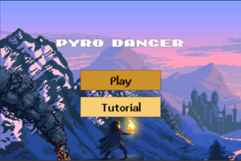
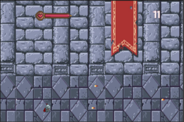
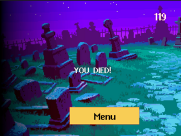
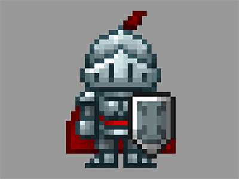

## Description 

Pyro Dancer is an endless-runner 2D game with heavy inspirations from notable titles, such as Castlevania and Metroid inspire the game. Paired with 8-bit sound and theme by Haynes, Pyro Dancer tries to mimic the retro feel of older games.

The player assumes the role of a knight, invading the evil castle. Upon entering the castle, he is greeted by dozens of fireballs. To win the game, the player must dodge the fireball and achieve 500 score points. If the player runs out of health points before reaching the score, they will die.

## Screenshots 

| In-game screenshots                  |
| ------------------------------------ |
|        |        
|    |
|  |

## Intended Gameplay

Players will have to dodge the fireballs by going up or down. They also have the choice to speed up their running by pressing the D key. As the score increases, so does the difficulty.

Above a certain score, players will be greeted by stationary monsters that instantly kill them upon touching. This would balance out the difficulty and create varied gameplay, as dodging only fireballs would be boring!

| Knight Sprite                    |
| -------------------------------- |
|  |

To win the game, players must reach a score of 1000 and proceed to the boss battle. (It is still in development, and I am unsure whether I will have the time to code it!)

## Development Notes

As the name suggests, Pyro Dancer will feature a knight running through a dracula-esque castle to save the princess. However, he is greeted by dozens of fireballs in the process.

This section reviews Romance languages. Lorem ipsum dolor sit amet, consectetur adipisicing elit, sed do eiusmod tempor incididunt ut labore et dolore magna aliqua. Ut enim ad minim veniam, quis nostrud exercitation ullamco laboris nisi ut aliquip ex ea commodo consequat. Duis aute irure dolor in reprehenderit in voluptate velit esse
cillum dolore eu fugiat nulla pariatur. Excepteur sint occaecat cupidatat non
proident, sunt in culpa qui officia deserunt mollit anim id est laborum.

##### Lecture videos

+ [Lecture video 1](https://youtu.be/3MZeJED2yns) – This is a first lecture video.
+ [Lecture video 2](https://youtu.be/8ihJsf-AXdA) – This is a another lecture video.
+ [Lecture video 3](https://youtu.be/79MSNfp1rw0) – This is a third lecture video. It is quite short.

##### Lecture notes

+ [Lecture note 1](lecture1.pdf)

##### Readings

+ [Paper 1](https://pascalmichaillat.org/1.pdf) – This is a first paper to read.
+ [Paper 2](https://pascalmichaillat.org/2.pdf) – This paper builds on the first one.
+ [Paper 3](https://pascalmichaillat.org/4.pdf) – This paper is more complex.

## Part 2: Portugese irregular verbs

This section introduces Portugese irregular verbs. Lorem ipsum dolor sit amet, consectetur adipiscing elit. Sed do eiusmod tempor incididunt ut labore et dolore magna aliqua. Ut enim ad minim veniam, quis nostrud exercitation ullamco laboris nisi ut aliquip ex ea commodo consequat. Duis aute irure dolor in reprehenderit in voluptate velit esse cillum dolore eu fugiat nulla pariatur. Excepteur sint occaecat cupidatat non proident, sunt in culpa qui officia deserunt mollit anim id est laborum.

##### Lecture videos

+ [Lecture video 4](https://youtu.be/IZI0_WwIyb8)
+ [Lecture video 5](https://youtu.be/Qz7CCB1-gu8)
+ [Lecture video 6](https://youtu.be/79MSNfp1rw0)

##### Lecture notes

+ [Lecture note 2](lecture2.pdf)

##### Readings

+ [Paper 4](https://pascalmichaillat.org/5.pdf) – This paper computes things. (Details about the simulations are presented in the paper's [online appendix](https://pascalmichaillat.org/5a.pdf).)
+ [Paper 5](https://pascalmichaillat.org/3.pdf) – This paper proves things. (The paper's [online appendix](https://pascalmichaillat.org/3a.pdf) contains long proofs and extensions of the results.)

## Part 3: Spanish irregular verbs

This section quickly discusses irregular verbs in Spanish. Lorem ipsum dolor sit amet, consectetur adipisicing elit, sed do eiusmod tempor incididunt ut labore et dolore magna aliqua. Ut enim ad minim veniam, quis nostrud exercitation ullamco laboris nisi ut aliquip ex ea commodo consequat. Duis aute irure dolor in reprehenderit in voluptate velit esse cillum dolore eu fugiat nulla pariatur. 

##### Lecture videos

+ [Lecture video 7](https://youtu.be/pIS8-mXG1oY)
+ [Lecture video 8](https://youtu.be/FUaeNM8_fxs)
+ [Optional lecture video](https://youtu.be/xjHVrx7jfdY)

##### Basic readings

+ [Paper 6](https://pascalmichaillat.org/10.pdf)

##### Advanced readings

+ [Paper 7](https://pascalmichaillat.org/11.pdf)
+ [Paper 8](https://pascalmichaillat.org/12.pdf)

## Conclusion

This section concludes by comparing Portuguese and Spanish irregular verbs to irregular verbs in other Romance languages. 

> Ut enim ad minim veniam, quis nostrud exercitation ullamco laboris nisi ut aliquip ex ea commodo consequat. Aenean magna nisl, mollis quis, molestie eu, feugiat in, orci. In hac habitasse platea dictumst. Quisque non felis. Nullam vulputate libero quis ligula. Fusce scelerisque suscipit sapien. Suspendisse commodo ullamcorper magna. 
> Duis aute irure dolor in reprehenderit in voluptate velit esse cillum dolore eu fugiat nulla pariatur. 

Excepteur sint occaecat cupidatat non proident, sunt in culpa qui officia deserunt mollit anim id est laborum.

