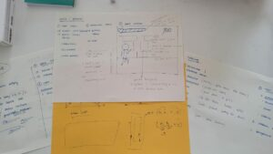

## Description 

##### Development Time: 3 - 4 Weeks

Pyro Dancer is an endless-runner 2D game with heavy inspirations from notable titles, such as Castlevania and Metroid inspire the game. Paired with 8-bit sound and theme by Haynes, Pyro Dancer tries to mimic the retro feel of older games.

The player assumes the role of a knight, invading the evil castle. Upon entering the castle, he is greeted by dozens of fireballs. To win the game, the player must dodge the fireball and achieve 500 score points. If the player runs out of health points before reaching the score, they will die.

The game was developed as a midterm project for New York University Abu Dhabi (NYUAD) Interactive Media program class: Introduction to Interactive Media, lectured by Aya Riad. 

## Screenshots 

| In-game screenshots                  |
| ------------------------------------ |
|        |        
|    |
|  |

## Intended Gameplay

Players will have to dodge the fireballs by going up or down. They also have the choice to speed up their running by pressing the D key. As the score increases, so does the difficulty.

Above a certain score, players will be greeted by stationary monsters that instantly kill them upon touching. This would balance out the difficulty and create varied gameplay, as dodging only fireballs would be boring!

| Knight Sprite                    |
| -------------------------------- |
|  |

To win the game, players must reach a score of 1000 and proceed to the boss battle. 

## Development

As the name suggests, Pyro Dancer will feature a knight running through a dracula-esque castle to save the princess. However, he is greeted by dozens of fireballs in the process.

##### Brainstorming Phase 

This was my very first take on using JavaScript, p5, and making a game. I wanted to make an "8-bit" endless runner game because of my inspiration from older titles. Plus, it would make a nice presentation as it is very thematic. 

| Sketches            |
| -------------------------------- |
|  |

##### Programming Phase

In order for me to make this game, I used an external library called p5.Play, an extensive game-oriented packed with QoL features. In my code, I used this package mostly for sprite animations for the knight and fireball. The package allowed me to also easily make the main menus and buttons. 

+ Building upon my previous knowledge from Computer Science classes, I heavily utilized OOPs, Classes, Parent-Child inheritance to easily make the objects inside the game. 

##### Shortcomings

Because of the tight deadlines, I was unable to actualize the boss fights and combat mechanics. There were major bugs in the development process that was caused by a certain version of p5.play incompatible with p5. 

## Conclusion & Insights 

Pyro Dancer was my very first video game that I made. It introduced me to the 'surface' level of game development and design pipeline. 

>Because of this, I truly found a passion, hobby, and pathway that I enjoyed. Being a developer and designer requires one to have a mind to approach things in various ways. 

