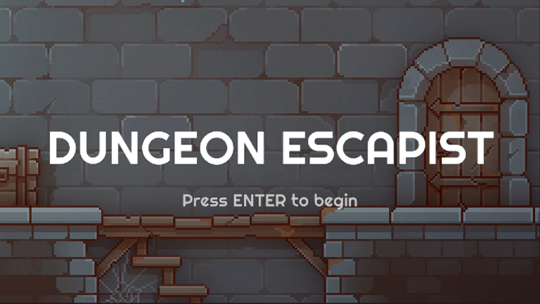
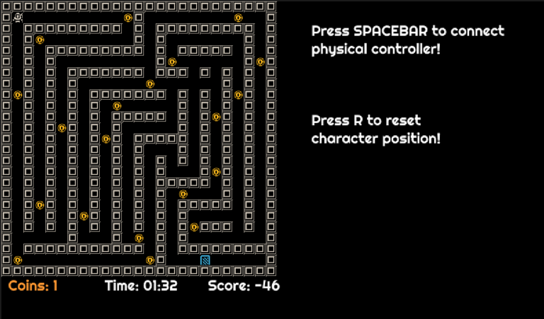
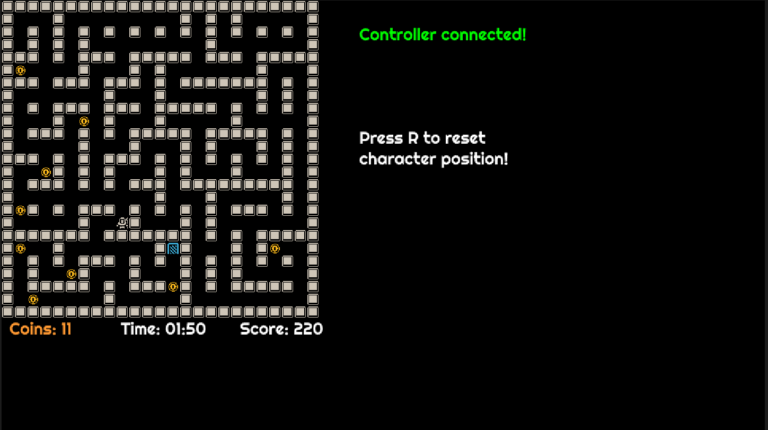
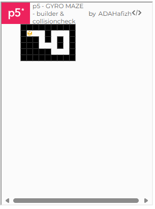
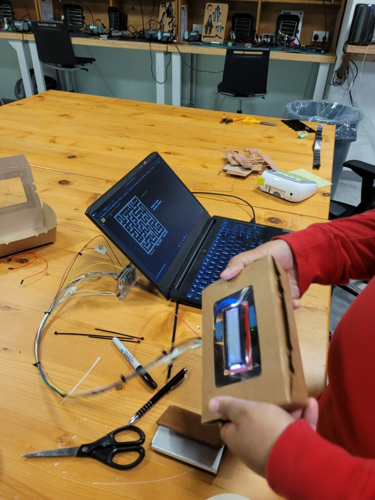

## Description 

##### Development Time: 4 Weeks
##### Featured in End of Semester Showcase

Dungeon Escapist is a single-player game where players take control of an adventurer and delve through a dungeon. By using a physical controller that reacts with tilting, players can move their character, collect coins, and reach the exit before the time runs out!

> ***Escapist (adjective)***
>
> relating to avoiding an unpleasant or boring life by thinking, reading, etc. –Cambridge Dictionary

The game is heavily inspired by older titles such as Adventure (1980), with interactive elements from The Legend of Zelda: Breath of the Wild (2017). This game is also a direct sequel to my previous game: [Pyro Dancer](https://adahafizh.github.io/projects/project1/).

Unlike the previous game, however, **Dungeon Escapist focuses more on problem-solving.** The main character, an adventurer, wishes to gain riches! He began to look around the Adventurer’s Guild to see if there were commissions. Noticing the dungeon-clearing request, our protagonist sets off to explore the uncharted areas in hopes of bathing in fame and fortune.

The game was developed as a final project for New York University Abu Dhabi (NYUAD) Interactive Media program class: Introduction to Interactive Media, lectured by [Aya Riad](https://ayariad.com). 

## Screenshots 

| In-game screenshots        |
| -------------------------- |
|  |
|   |
|   |

## Intended Gameplay

Players use a custom Arduino Gyroscope controller to move their character. Within a certain time limit, players have to solve their way out of a maze. There are coins in the maze that the players can pickup. In the end, their scores are put in a leaderboard.

<iframe width="560" height="315" src="https://www.youtube.com/embed/za6ixTd8kjw?si=TYFxWhLFje5QykqR" title="YouTube video player" frameborder="0" allow="accelerometer; autoplay; clipboard-write; encrypted-media; gyroscope; picture-in-picture; web-share" referrerpolicy="strict-origin-when-cross-origin" allowfullscreen></iframe>

## Development

The development of this game is split into three stages: idea phase, physical controller development, and software development. 

##### Brainstorming Phase 

As a final project, we had to incorporate physical and digital elements to our program. In Breath of the Wild, there are mazes with spheres that the player have to control by tilting their controller. I was inspired by this mechanic and wanted to develop a game with my own twist. 

+ I settled with having the players use a physical controller
+ The character cannot change direction until stopped by a wall or obstacle.

The one directional movement thus defines how the game plays out. Players have to decide if they want to prioritize finishing the maze, or collect all coins whilst bound by movement rules. 

##### Programming Phase

In order for me to make this game, I used an external library called p5.Play, an extensive game-oriented packed with QoL features. In my code, I used this package mostly for sprite animations and building the maze from an array.  

| Maze Development        |
| -------------------------- |
|  |

+ Building upon my previous knowledge from Computer Science classes, I heavily utilized OOPs, Classes, Parent-Child inheritance to easily make the objects inside the game. 

##### Tinkering Phase 

For my physical controller, I wanted it to be handheld just like an Xbox or PS controller. I resorted to a fries box where I can store the Arduino components inside, and it was transparent to allow me tinker out bugs if they appear. **This choice would later award me with a sustainable design in the final evaluation!**

| Controller Testing       |
| -------------------------- |
|  |

After implementing both physical and digital systems, plus heavily user tested them, **I added few more mazes that were generated using a Java code.** These mazes would allow the players to have a certain degree of variation and complexity to their gameplay. 

##### Shortcomings

Because of the tight deadlines, I was unable to actualize the scoreboard system in p5.js. However, the reception from user testing in the showcase was positive, and it felt very great to finally have a game that is enjoyed by many.

## Conclusion & Insights 

Dungeon Escapist solidified my resolve to be a game designer/developer. While I enjoyed the programming part, designing the mazes, character movement, gameplay rules were the part that I enjoyed the most. 

> “I was confused with the controls in the beginning … It is quite difficult!” -A professor

> “Pretty cool.” -I.M Senior

> “It’s difficult to control in the beginning. But once you get the hang of it, it gets easier.” -A lost engineer

> “Cool game. The UI/UX can be improved though” -An I.M Professor

