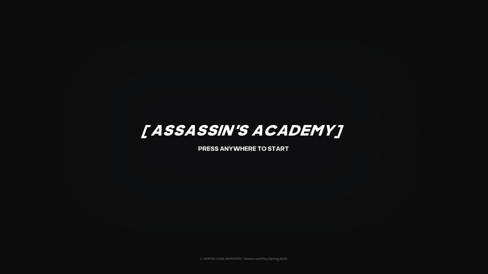
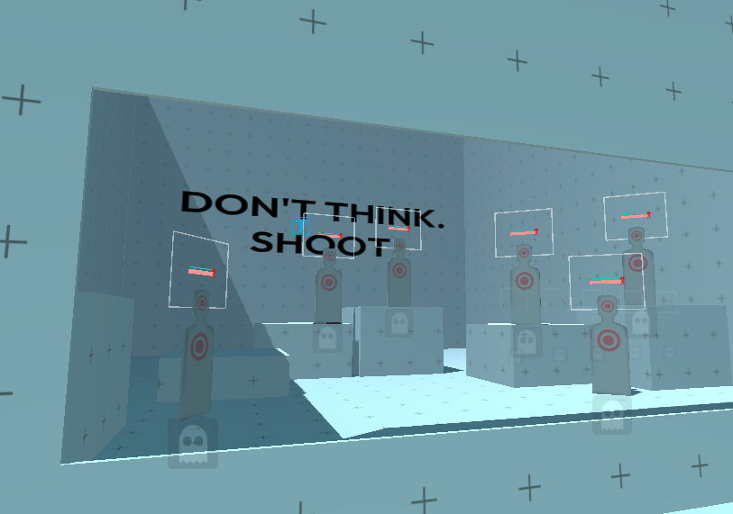
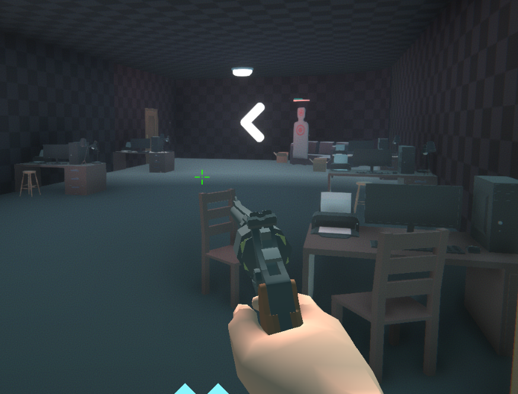

## Description 

##### Development Time: 3 Weeks

Assassin Academy is a fast-paced singleplayer first-person shooter game. You are a candidate for the best assassin spot in the world. Take your weapon, finish missions, dodge traps, bullets, and bring death! 

An assignment for Games and Play Spring 2024, part of Interactive Media program in New York University Abu Dhabi (NYUAD) taught by [Domna Banakou](https://domnabanakou.com/).

## Screenshots 

| In-game screenshots        |
| -------------------------- |
|  |
|  |
|         |

## Intended Gameplay

Players will pick up one weapon out of several many. There are various pre-generated maps, complete with enemies, traps, and loot. Scores will be count based on speed and execution.

##### Demo
<iframe width="560" height="315" src="https://www.youtube.com/embed/i1AA3GSpK2A?si=9uxGeqqYRiQiRoqm" title="YouTube video player" frameborder="0" allow="accelerometer; autoplay; clipboard-write; encrypted-media; gyroscope; picture-in-picture; web-share" referrerpolicy="strict-origin-when-cross-origin" allowfullscreen></iframe>

To win the game, players must defeat their primary target within a certain time limit. 

## Development

##### Brainstorming Phase 

This was my first take on making a 3D First-Person Shooter (FPS) game. The idea stemmed from having a zombie-survival game, to a Ultrakill / SUPERHOT inspired gameplay. Initially, I wanted to make the game feature a one-bullet "hit or miss" scenario, where players can only shoot a target. 

+ Players receive a bullet in their weapon
+ If player kills a target, they will gain another bullet
+ But, if player misses, they have to use melee weapon

##### Programming Phase

In order for me to make this game, I used an external library called Cowsin's FPS, an extensive Unity Package suited towards FPS games. Then, I heavily modified the package to suit my needs. 

+ Building upon my previous knowledge from Computer Science classes, I heavily utilized OOPs, Classes, Parent-Child inheritance to easily make the objects inside the game. 

##### Shortcomings

Because of the tight deadlines, I was unable to actualize the actual gameplay and only kept the fast-paced movement feel. I tried to implement the one-bullet system, but it wasn't working as great as I had hoped. 

## Conclusion & Insights 

I really enjoyed making Assasin Academy. It made me realize the challenges that come with game development & design. 

