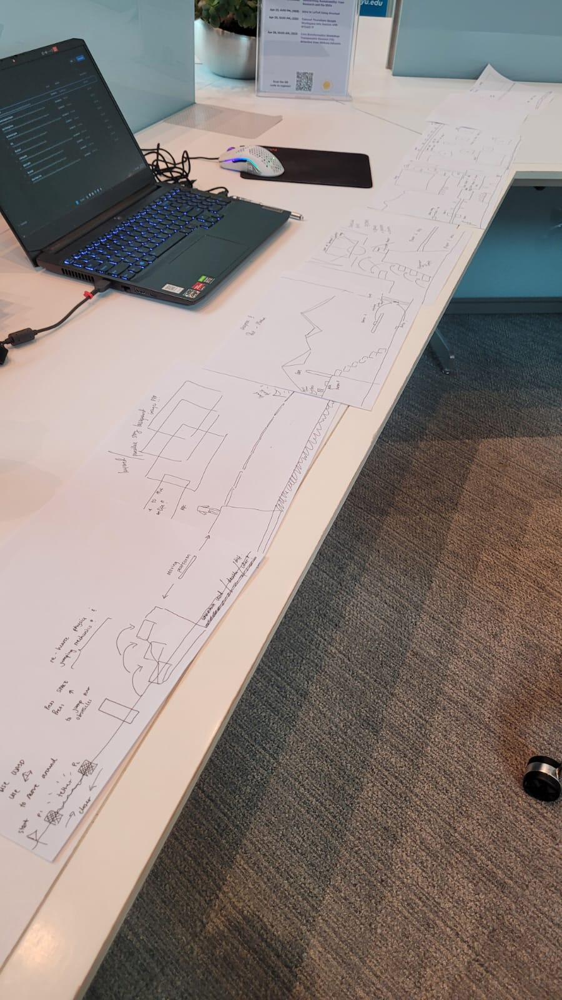
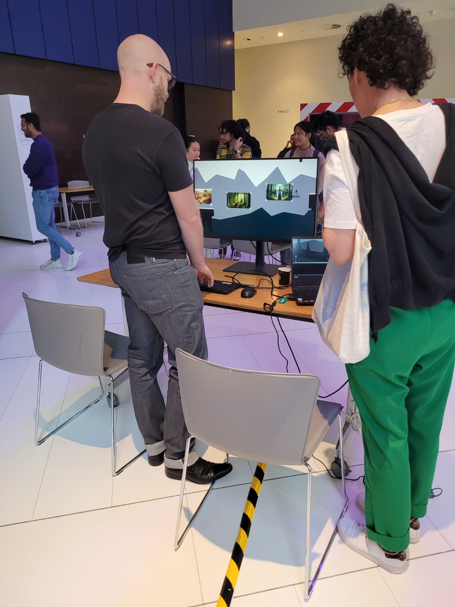
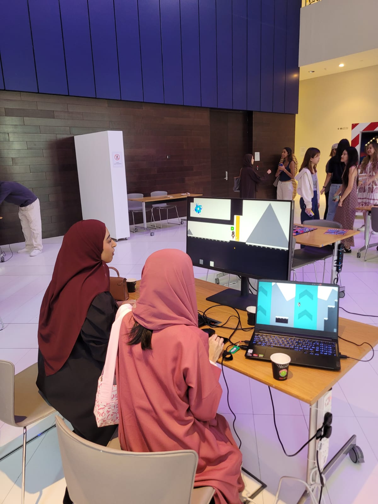

## Description 

##### Development Time: 6 Weeks (&plusmn;100 Hours)
##### Group project, personal role: level designer 
##### Featured in the IM Program End of Semester Showcase ⭐

SOULMATES is exclusively a two-player game, designed for both players to engage simultaneously on a single computer. The primary objective of the game is to foster teamwork and cooperative problem-solving as players guide the souls through their journey, discovering their identities and stories.

+ Local Coop, play with your friends or partners!
+ Three chapters, 15+ minutes gameplay
+ Portals, Lock N' Keys, Moving Platforms, Grappling Hooks and more!

Our game is heavily inspired by similar coop games such as *Bred and Fred*. This game was developed as a final project for Games and Play Spring 2024 class, part of the Interactive Media (IM) program in New York University Abu Dhabi, lectured by [Domna Banakou](https://domnabanakou.com/).

## Screenshots 

| All Chapters        |
| -------------------------- |
|  |

## Intended Gameplay

Two players use WASD and Arrow Keys to control the characters. 
+ This control scheme emphasizes the game's focus on teamwork and communication, as players must coordinate their actions closely to solve puzzles and advance the story. The dual-player mode is essential for the narrative and mechanics of "Soulmates". 

Players are encouraged to work together in real-time, making decisions that affect the game's outcome. 
+ This setup enhances the game's thematic elements of companionship and togetherness, providing a unique interactive experience. 

These two aspects are central to the concept of "Soulmates", ensuring players can experience the full depth of the game's cooperative and storytelling potential.

##### Demo Video 

<iframe width="560" height="315" src="https://www.youtube.com/embed/F_t7Cr7kWhk?si=P_Lb_w4EFODO5-na" title="YouTube video player" frameborder="0" allow="accelerometer; autoplay; clipboard-write; encrypted-media; gyroscope; picture-in-picture; web-share" referrerpolicy="strict-origin-when-cross-origin" allowfullscreen></iframe>

## Development: LEVEL DESIGN

##### Brainstorming Phase 

> The development of "Soulmates" started by defining a clear vision: to create a cooperative puzzle-solving game that emphasized storytelling. The core idea was to intertwine the game mechanics with the narrative, making each puzzle a part of the unfolding story about two souls discovering their past. 

> As such, cooperation is mandatory with puzzles that cannot be solved by players acting independently. This enforces the theme of togetherness and mutual dependence. The game is set in a limbo-like world, chosen for its symbolic representation of the characters' state — between their past lives and their potential redemption. This setting supports the narrative. The decision was influenced by the desire to create a space that felt both mysterious and engaging, encouraging exploration and cooperation. 

#### Design Phase 

| Level Design Sketch        |
| -------------------------- |
|  |

After a long thought and contemplation, as the one in charge of designing the levels, I envision *'progressive'* stages to the gameplay experience. What I mean by this is that there is a **curve where the players transition from a simple gameplay to more challenging puzzles.**

The general idea of each chapter is laid out as such: 
+ **Chapter I:** The introductory level, here, the players are introduced to the playable characters (Dark and Light spirits), control schemes, platformer, and lore. 
+ **Chapter II:** I expect by this point players are quite 'familiar' with the gameplay loop. Here, I introduce more mechanics to the game, such as grappling hooks, ladders, anti-gravity zones. The focus on this chapter is an emphasis on full cooperative puzzle solving. 
+ **Chapter III:** By this point, the players have encountered all mechanics. As a refresher, I introduced a 'flipped world' scenario where one of the players are in a mirror world beneath, creating a new depth in difficulty. 

Beyond the systems, I fitted the levels' aesthetics to fit the Limbo narrative. All sprites and blocks are chosen and made carefully by our character designer, Yaakulya. Aligning with stories made by Ronit, I adjusted the designs of each chapter to serve a purpose: 
+ The level designs as a lore/storytelling device, which can be seen from the castle, destroyed world, and heaven in the introductory world.

## Playtest 

Our game was featured in the end of the semester showcase, where it was heavily playtested by over hundred players. 

| Thank you to all!            |
| ---------------------------- |
|  |
|  |

Here are some key takeaways that I gained which would improve the game experience:

1. **Assume players are new to video games:** I noticed that even in the introductory level, the moving platforms were too fast for players to caught on. This was a consequential effect because the control scheme wasn't introduced properly / too short. 
2. **Unclear narrative:** Because we were avoiding dialogues in our game, the images were overshadowed by the challenges presented in the game. What could have been done was to split the images and puzzles.
3. **Difficulty spike:** I designed the game as a gamer with thousands of hours of experience, yet for these players, the puzzles and challenges presented between levels spiked too high. This can be mitigated by slowly introducing and ramping up the difficulty. 

In short, the game could benefit more from splitting the levels into smaller sub-sections to help players adjust to the overall control schemes. 'Breaks' are also required to help them absorb and read the narrative of the game. 

## Onwards & Beyond

I really enjoyed the overall process of developing and designing SOULMATES. It was my first introduction to an actual development pipeline as we were working in groups. In my opinion, our group synergy was amazing because everyone did the things they enjoyed & skilled the most.
 

