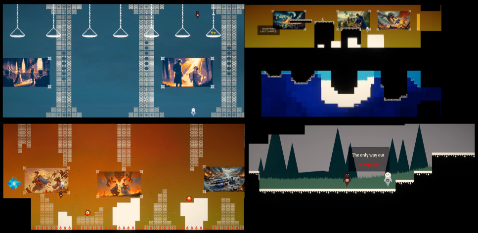

## Description 

##### Development Time: 6 Weeks (100 Hours)
##### Group project, personal role: level designer 
##### Featured in the IM Program End of Semester Showcase ⭐

SOULMATES is exclusively a two-player game, designed for both players to engage simultaneously on a single computer. The primary objective of the game is to foster teamwork and cooperative problem-solving as players guide the souls through their journey, discovering their identities and stories.

+ Local Coop, play with your friends or partners!
+ Three chapters, 15+ minutes gameplay
+ Portals, Lock N' Keys, Moving Platforms, Grappling Hooks and more!

This game was developed as a final project for Games and Play Spring 2024 class, part of the Interactive Media (IM) program in New York University Abu Dhabi, lectured by [Domna Banakou](https://domnabanakou.com/).

## Screenshots 

| All Chapters        |
| -------------------------- |
|  |

## Intended Gameplay

Two players use WASD and Arrow Keys to control the characters. This control scheme emphasizes the game's focus on teamwork and communication, as players must coordinate their actions closely to solve puzzles and advance the story. The dual-player mode is essential for the narrative and mechanics of "Soulmates". Players are encouraged to work together in real-time, making decisions that affect the game's outcome. This setup enhances the game's thematic elements of companionship and togetherness, providing a unique interactive experience. This is central to the concept of "Soulmates", ensuring players can experience the full depth of the game's cooperative and storytelling potential.

##### Demo Video 

<iframe width="560" height="315" src="https://www.youtube.com/embed/F_t7Cr7kWhk?si=P_Lb_w4EFODO5-na" title="YouTube video player" frameborder="0" allow="accelerometer; autoplay; clipboard-write; encrypted-media; gyroscope; picture-in-picture; web-share" referrerpolicy="strict-origin-when-cross-origin" allowfullscreen></iframe>

## Development: LEVEL DESIGN

##### Brainstorming Phase 

I wanted to create a simple racing game, that's it. This was my very first take on Unity and the tranasition from Unreal Engine workflow to Unity was an interesting process. Alas, I wanted to push how much I could design the race tracks, car physics, and aesthetics in general. 

+ I chose low poly designs because it aligns with the simplicty aspect 

##### Programming Phase

Instead of using the racing kit template provided by the class, I chose to 'reinvent' the wheel and start from scratch. The work is split between a few things:

+ Car physics & controller
+ Sound manager
+ Logic systems (timer, finish line, track points)

##### Shortcomings

Because of the tight deadlines, I was unable to actualize the AI versus system. But from this project, I learned the basics of Unity which also serve as the building blocks for future projects. 

## Conclusion & Insights 

I got an A for this project, pretty satisfied. 
